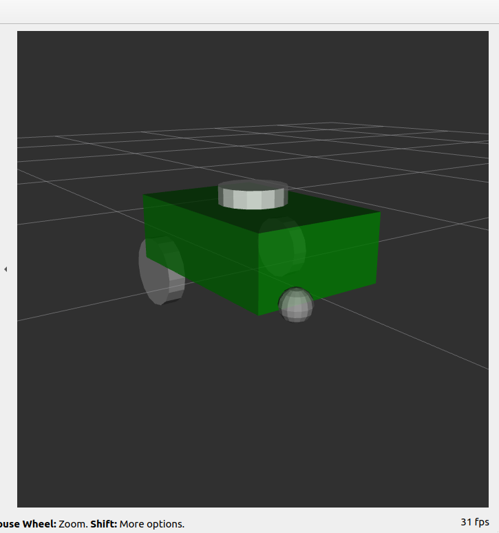

# ROS 2 Rust Navigation Node

## Overview

This project showcases a navigation node for a two-wheel robot implemented in Rust using the ROS 2 Humble distribution. The node subscribes to the current position and publishes goal positions, enabling basic navigation functionalities.

## Project Structure

-   **nav_node/**: Contains the Rust package for navigation.
    -   **src/**: Source code for the navigation node.
    -   **Cargo.toml**: Rust dependencies and package information.
    -   **CMakeLists.txt**: CMake configuration for the package.
    -   **package.xml**: ROS package configuration.
-   **two_wheel_robot/**: Contains the URDF description of the two-wheel robot.
    -   **urdf/**: Directory containing the URDF file.
    -   **CMakeLists.txt**: CMake configuration for the URDF package.
    -   **package.xml**: ROS package configuration.

## Requirements

-   ROS 2 Humble
-   Rust programming language
-   Cargo (Rust package manager)

## Setup Instructions

1. Clone the repository:

    ```bash
    git clone https://github.com/yourusername/ros2_rust_ws.git
    cd ros2_rust_ws
    ```

2. Build the workspace:

    ```
    colcon build
    ```

3. Source the workspace:

    ```
    source install/setup.bash
    ```

4. run the nav node:

    ```
    ros2 run nav_node
    ```

## Robot pov:


